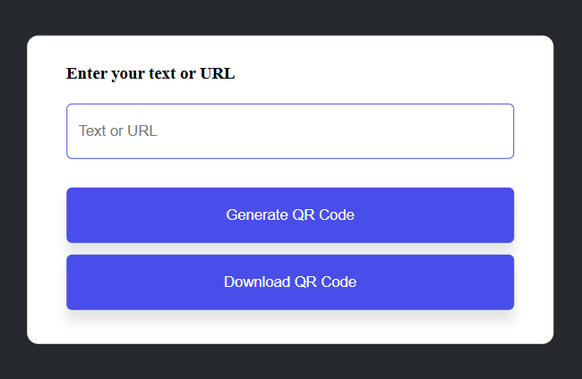

# QR Code Generator Website

This project is a simple web application that allows users to generate QR codes from text input. It's built using HTML, CSS, and JavaScript, and can be used directly in your web browser without the need for any server-side setup.

---

## Features

- **Real-time QR Code Generation:** As you type into the input field, the QR code updates instantly.
- **Downloadable QR Codes:** After generating a QR code, you can download it as an image file to your device.
- **User-Friendly Interface:** The application features a clean and intuitive design, making it easy for anyone to use.
- **Error Handling:** Provides feedback if the input field is empty.

---

## Usage

- **Open the Application:** Launch the index.html file in your web browser.
- **Enter Text:** Type the desired text or URL into the input field.
- **Generate QR Code:** The QR code will automatically generate and display on the page as you type.
- **Download QR Code:** Click the "Download QR Code" button below the QR code to save it as an image file to your device.

---

## Technologies Used

- **HTML5:** For structuring the web page.

- **CSS3:** For styling and layout.

- **JavaScript:** Logic for generating and downloading QR codes.
  
- **External API:** `https://api.qrserver.com` is used to generate QR codes dynamically.

---

## Live Demo

Check out the live demo of the QR Code Generator Website:  

[Live Demo](https://ankita34359.github.io/QR-Code-Generator-Website/)

---

## Image of QR Code Generator Website

## Installation and Setup

Follow the steps below to set up and run the QR Code Generator locally:

### 1. Clone the Repository: 
`git clone https://github.com/ankita34359/QR-Code-Generator-Website-.git`

### 2. Navigate to the Project Directory: 
`cd QR-Code-Generator-Website`

### 3. Open the Project in Your Browser

Simply open the index.html file in any modern web browser to view the QR Code Generator.

---

## Project Structure

QR-Code-Generator-Website-

│

├── index.html       # HTML structure of the website

├── style.css        # CSS file for styling

├── script.js        # JavaScript file for functionality

├── README.md        # Project documentation

---

## Dependencies

**Axios:** The axios library is used to fetch the QR code as a blob for downloading. Include it using the following CDN:

``

---

## Contributing

Contributions are welcome! If you have suggestions for improvements or encounter any issues, please feel free to open an issue or submit a pull request.

---

## License

This project is licensed under the MIT License. See the LICENSE file for more details.

---

## Contact

If you have any questions, suggestions, or would like to discuss anything, feel free to reach out:

- GitHub: 
- Linkedin: https://www.linkedin.com/in/ankita-gupta-34359abcd/

---

Feel free to star ⭐ this repository if you find it helpful.
